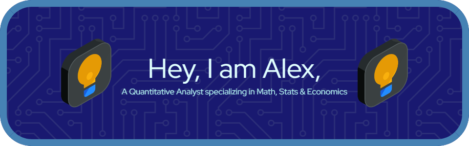

# Hey, I am Alex Yu 😎

## About Me 😀
I am currently an undergraduate student at the University of Toronto, with a focus on mathematics, economics, and statistics. I enjoy working on projects and conducting self-research in these fields for fun. My academic journey has endowed me with a robust analytical foundation and a keen interest in decoding intricate data structures.

I aim to seamlessly integrate statistical methodologies with economic and finance frameworks. Driven by a vision to apply mathematical theories to real-world economic phenomena, I am earnestly exploring opportunities that will allow me to collaboratively innovate, challenge conventional paradigms, and contribute to knowledge intersections between these fields.

As I progress through my academic and professional journey, I welcome connections with industry leaders, researchers, and enthusiasts who share a similar zest for these disciplines. Together, we can harness the power of mathematics to craft compelling narratives in the economic landscape.

## Skills 🧐
- **Programming Languages & Tools:**
  - **Python:** Numpy, pandas, matplotlib, PyTorch, SciPy
  - **R:** Linear regression, tidyverse, dplyr, ggplot2, statistics with R
  - **MATLAB:** Basic programming and visualization
  - **LaTeX:** Fluent in typesetting academic papers and documents
  - **Microsoft Office:** Proficient in Word, Excel, and PowerPoint

- **Mathematics:**
  - Basic Analysis I and II
  - Ordinary and Partial Differential Equations
  - Real and Complex Analysis
  - Abstract Mathematics
  - Graph Theory
  - Elementary Number Theory
  - Mathematical Modelling
  - Financial Mathematics
  - Linear Algebra

## Contact Me
- **Email:** [18165241737yuhaoran@gmail.com](mailto:18165241737yuhaoran@gmail.com)
- **LinkedIn:** [My LinkedIn Profile](www.linkedin.com/in/haoranyu12)

Feel free to reach out to me for collaboration, discussion, or any opportunities related to my fields of interest. Let's connect and create something impactful together!
